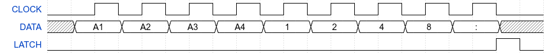
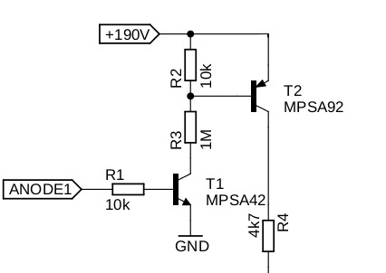
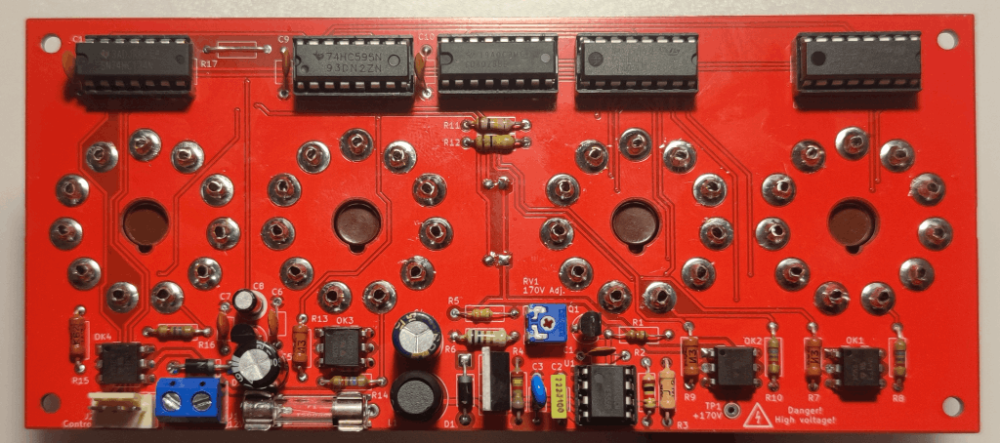

# LPT-Nixie-Clock
DOS-controlled Nixie clock, built with four IN-1/LC-516 tubes and interfaced through the LPT port.

## Features
* Supports IN-1 and LC-516 Nixie tubes
* Multiplexed display with four digits and a colon
* Onboard high-voltage boost converter; requires only a single 12V power supply
* Serial control interface using just three control wires
* Hardware designed exclusively with easily available components
* Control software implemented as a DOS TSR written in TASM
* Uses the AT-style RTC programming model as the time source and multiplexing timebase
* Connection via the PC’s LPT port

## Motivation
This project is another attempt to answer a question I’ve been asking myself ever since I built the [Xi8088](https://github.com/skiselev/xi_8088):

*What can I use this PC for that it was never really designed to do, yet is still possible, reasonably practical, and fun to work on?*

My first attempt was a WAV player - [WAVWSS](https://github.com/Lefucjusz/WAVWSS). With that working, I started looking for another challenge, Nixie clock felt like a perfect next step:

* it smoothly merges insanity with practicality: it is a Nixie clock - a useful and visually appealing device - controlled by genuinely ancient hardware that
was never intended for such a task, especially not via a printer port;
* while not fully period-correct, the combination of a PC/XT-class computer built largely from 74xx TTL logic and Nixie tubes has a strong appeal for a low-level
tinkerer like me :smile:;
* it provided a good opportunity to learn long-forgotten skills such as writing DOS TSRs, particularly in assembly language, the task I had never tried before.
The project is programmatically simple, making debugging relatively straightforward when things went wrong;
* it allowed me to validate the idea of a Nixie tube driver circuit built entirely from easily available components, avoiding long-discontinued parts such as
SN74141 or its Soviet counterpart K155ID1, which are increasingly expensive and slowly becoming unobtainium;
* finally, it gave me the motivation to put to use a set of IN-1 Nixie tubes I bought around 2020, but had never used due to their large, hard to use sockets.

## Hardware

> [!CAUTION]
> This project involves high voltages! Although the external power supply is only 12V, voltages of around 200V are present on the PCB and components during normal
operation. Even higher voltages may occur if the boost converter feedback loop malfunctions, for example due to incorrect PCB assembly. **Such voltages can be lethal.**
The author takes no responsibility for any damage, injury, or loss resulting from the use or construction of this project. Build and operate it entirely at your own risk.

> [!WARNING]
> Use of this project may pose a risk to your vintage hardware. The author accepts no responsibility for any resulting damage.
 
### Schematic and PCB layout

[Schematic](https://github.com/Lefucjusz/LPT-Nixie-Clock/blob/master/kicad/lpt_nixie_clock_schematic_color.pdf)

[PCB layout](https://github.com/Lefucjusz/LPT-Nixie-Clock/blob/master/kicad/lpt_nixie_clock_board_color.pdf)

### Principle of operation

#### Logic design and display interface
The logic section, which forms the input interface for the display, consists of U3 (4028), U6 (74HC595), and U7 (74HCT74). U6 together with U7 forms a 9-bit
SIPO register with an output latch. The register outputs are connected to:
* the anode drivers for the Nixie tubes;
* the colon cathode driver;
* the BCD-to-decimal decoder (U3), which controls the Nixie cathode drivers.

The display operates in a multiplexed fashion: all corresponding Nixie digits share connections, and only one tube is turned on at a time. Rapidly switching between
tubes (every 1/64 millisecond in this project) creates the illusion that all tubes are lit simultaneously. This approach drastically reduces the number of required shift
register outputs or control lines compared to static (individual) tube control.

The display control word is loaded serially using three lines: `DATA`, `CLOCK`, and `LATCH`. The loading occurs in two steps:
1. The control word is shifted into the register using the `DATA` and `CLOCK` lines.
2. After the word is fully loaded, a rising edge on the LATCH line updates the output register.

The exact timing diagram, along with a description of each control word bit, is shown below.



* `A1..4` - logic high enables the anode driver, A1 is the leftmost tube
* `1..8` - BCD value of a digit to be displayed
* `:` - logic high turns on the colon 

Some design choices may seem unusual at first. Initially, I did not use the 4028 decoder for the cathode control signals. Instead, the inputs of the Nixie cathode drivers
were connected directly to the outputs of two cascaded 74HC595 shift registers. The problem with this approach was efficiency: sending 15 bits
(10 cathodes, 4 anodes, colon) to a shift register is more costly than sending just 9 bits. Each bit requires 3 OUT instructions:
1. set `DATA` line state,
2. set `CLOCK` line high,
3. set `CLOCK` line low.

Each control word also requires a `LATCH` toggle to update output register: 2 additional OUT instructions.

At a 256Hz multiplexing rate, using a 15-bit register results in:

```
256 * ((15 * 3) + 2) = 12032 OUT instructions per second
```

Tests on a breadboard prototype showed that spamming the LPT port with this many instructions from within an ISR was beyond the capabilities of an 8088 at 4.77MHz.
Even at 8MHz, the PC was noticeably slowed - for example, WAV playback using WAVWSS would stutter while the clock was running.

Switching to a 9-bit register reduces the required instructions to:

```
256 * ((9 * 3) + 2) = 7424 OUT instructions per second
```

Still significant, but much more manageable.

With a 9-bit register, only one bit of a second, cascaded 74HC595 was actually needed. Rather than using an entire additional shift register just for a single bit,
I replaced it with a 74HCT74 flip-flop, which met the circuit requirements much better. I also happened to have plenty of 74x74 chips and only a few 74HC595s, so this
choice made it easy to make good use of the components I already had on hand.

#### Anode drivers
For the anode drivers, I usually go with the classic solution of a two-transistor high-side switch, which allows controlling high voltages using standard logic levels.


<figcaption><i>Two-transistor high side switch</i></figcaption>

<br />
<br />

This time, however, I decided to experiment with an approach using optocouplers. I had seen similar solutions in other projects, but they typically used TLP627
optocouplers or alternatives with a similarly high collector-emitter breakdown voltage `VCEO ≈ 300V`. They are much harder to source than common, widely
available types.

I wondered whether such a high breakdown voltage was really necessary. After some consideration, I thought that as long as the following condition is met, the
circuit should operate correctly:

```
Va < Vm + VCEO

where: 
Va - anode voltage from boost converter
Vm - maintaining voltage of a Nixie tube
VCEO - collector-emitter breakdown voltage of an optocoupler’s transistor
```

Looking through my components, I found a few CNY17-3 optocouplers with `VCEO = 70V` and decided to test them in a prototype circuit. They worked, and also reduced
the component count compared to the traditional 2-transistor driver, so I decided to keep this solution.

#### Cathode drivers

Using the same reasoning as for the anode driver, I decided to experiment with ULN2004 chips for the Nixie cathode drivers. These have a VCEO of only 50V, so
this solution is definitely not very robust and is far from production-ready. The drivers operate close to or even slightly above their absolute maximum ratings.

During several months of testing, I didn’t blow a single ULN2004 channel, so either I was very lucky or happened to have particularly sturdy chips. However, the
ULN2004-based solution does cause an issue when driving the neon bulbs used for the colon; see [Known Issues](#known-issues).

> [!WARNING]
> If anyone comes across this project and wants to take inspiration from it, please avoid this approach in your own projects! Operating so close to the maximum 
ratings of components is an engineering antipattern that should be avoided whenever possible, even in non-critical applications.

#### Boost converter

The boost converter circuit is a classic NE555-based circuit, using the chip in a somewhat unconventional way. This design has a number of drawbacks: low efficiency,
feedback that affects not only the duty cycle but also the switching frequency, poor voltage stability under varying load, significant temperature drift due to the
reference being based on forward voltage of feedback transistor's B-E junction, etc.

Despite these limitations, I chose this approach for one main reason: it is simple and relies only on widely available components.

### PCB assembly

> [!WARNING]
> Nixie tubes and neon bulbs are mounted on the opposite side of the PCB from the rest of the components.

#### Top side

The top side of the PCB contains all components except the Nixie tubes and neon bulbs. When assembling this layer, install the components from the smallest to the largest -
this makes the process much easier.

Pay close attention to the polarity of diodes and electrolytic capacitors, and ensure all ICs are installed with the correct orientation - `U4` and `U5` are oriented differently
from the rest. I strongly recommend using sockets for all ICs. I use them in all of my projects: they are inexpensive and can save a lot of soldering work if any IC ever
needs to be replaced.

#### Bottom side
The bottom side of the PCB is where the Nixie tubes and neon bulbs are mounted. Start by installing the Nixie tubes. They can be either soldered directly to the PCB or
socketed. Both approaches have their advantages and drawbacks:
* direct soldering is quicker, but replacing a tube later will be difficult and will require desoldering;
* socketing makes tube replacement easy, but is more involved during assembly.

If you decide to solder the tubes directly, there is not much to watch out for - the tube base is keyed, so simply align it correctly, insert it into the PCB, and solder.

If you decide to use sockets, the process is a bit more complicated. Unfortunately, Nixie tube sockets were never standardized and are no longer manufactured, so they are
not available as off-the-shelf parts. For this design, I used female terminals intended for 5.08mm Molex-type CD/HDD power connectors. These are widely available and likely to
remain so for the foreseeable future.

However, these terminals cannot be used as-is - they require slight modification to fit the circular pads on the PCB. This is the most tedious part of the socketing process:
1. Remove the cable crimp section of the terminal by cutting or breaking it off. Its irregular shape prevents the terminal from fitting properly into the circular PCB pad.
2. Check the fit in the PCB pad. Some terminals have a slightly oversized diameter. If a terminal does not fit easily, gently squeeze the soldering end with pliers to reduce
the diameter.


<figcaption><i>Molex terminal with cable crimp section removed</i></figcaption>

<br />
<br />

Perform these two steps on all terminals before proceeding, so that they are ready for installation.

Once all terminals are modified, install the first set onto the pins of a Nixie tube. Installing the terminals on the tube first and inserting the assembly as a whole makes
it much easier to keep the terminals properly aligned. After the entire set of terminals is placed on the tube, align it with the PCB footprint using the base key, then
carefully insert all terminals into their respective pads. This step requires some patience; tweezers are very helpful here.

Once all pins are fully inserted - ideally up to the retention springs - solder the terminals, remove the tube, and repeat the entire process for the remaining three Nixie tubes.

After all the terminals have been soldered, install the neon bulbs, then insert Nixie tubes into the sockets.

#### Cleaning and final inspection

When the assembly is completed, clean the PCB thoroughly using isopropyl alcohol to remove any residual flux. Perform a careful final inspection: check for bad solder joints,
accidental solder bridges or any potential shorts. Make sure all ICs are correctly oriented and look for any obvious mistakes before powering up the board.


<figcaption><i>Fully assembled PCB - top view</i></figcaption>

<br />
<br />

### Bring-up

After the PCB is assembled and cleaned, the device is ready to be powered up for the first time. If the board has been assembled correctly,
it should work without issues. During the initial power-up, the Nixie tube anode voltage must be set to 170V. This adjustment is performed only once.

> [!CAUTION]
> Reminder: high voltages (up to approx. 200V) are present on the PCB during this procedure. Neither the board nor any components should be touched while the device
is powered. Capacitor C4 may remain charged for several minutes after the power supply has been turned off. Do not touch the board or components immediately after
power-down; always verify that the high-voltage rail has discharged before handling the PCB.

1. Set the `RV1` potentiometer (labeled `170V Adj.`) to approximately its mid-position. This provides a safe starting point and helps ensure that the output voltage
will not exceed the target value.
2. Connect a voltmeter with a range of at least 200V to the `TP1` test point.
3. Connect a 9-12V power supply with a current rating of at least 0.5A to the `J1` connector, observing correct polarity. The circuit includes reverse-polarity
protection, but it will not operate if the supply is connected backwards. If available, a bench power supply with adjustable current limiting is strongly recommended. 
Set the current limit to 0.5A.
4. Do not connect the control signals at this stage.
5. Turn on the power supply. Some digits may begin to glow faintly - this is normal. Upon power-up, the output states of the SIPO register are undefined. Due to
limitations of the 74HC595 reset mechanism (it clears only the shift register, not the output register), implementing a power-on reset circuit that guarantees all
tubes are off would significantly increase circuit complexity. Since the display is not intended to operate without control signals, I've decided that this behavior
is acceptable.
6. Adjust `RV1` until the voltage at `TP1` reads 170V ±2V. Turning the potentiometer clockwise increases the voltage; turning it counterclockwise decreases it.
**If the voltage at `TP1` exceeds 250V and cannot be reduced using `RV1`, immediately turn off the power supply and verify the assembly of the boost converter's
feedback loop. Continued operation at this voltage may cause `C4` to fail catastrophically.**
7. Turn off the power supply.
8. Connect the control signals.
9. Start the DOS TSR.
10. Turn the power supply back on. If the board has been assembled correctly, the display should show the current RTC time, and the colon should blink once per second.

### Known issues

#### Colon not turning off completely
This issue is caused by the low VCEO rating of the ULN2004. Neon bulbs have a much lower maintaining voltage than Nixie tubes and as a result, the condition
described in the [Anode Drivers](#anode-drivers) is not met. This causes the ULN2004 output transistor to enter C-E breakdown. Although the transistor is not
damaged due to the limited current, it continues to conduct even when its base is not being driven.

I didn't notice this problem during prototyping stage, as the neon bulbs I initially used happened to work correctly under these conditions. They likely have 
an unusually high maintaining voltage.

This issue can be worked around in two ways:

1. **Add a parallel resistor across each neon bulb.** Solder the resistor directly to the pads of each bulb. A value of 470kΩ works well in most cases. This forms
a resistor divider with the neon bulb’s  current-limiting resistor and lowers the voltage across the bulb below its maintaining voltage, even while the driver
transistor is in breakdown.
2. **Lower the anode voltage** using `RV1` until both neon bulbs fully extinguish when turned off. This will also reduce the brightness of Nixie tubes, though.

#### Too large footprint for non-polar capacitors
Somehow, I ended up selecting a footprint with a 7.5mm pin pitch instead of 5mm, and didn’t notice it despite reviewing the project countless times before placing an
order for PCBs. As a result, typical 100nF ceramic disc capacitors are too narrow for the footprint, and their leads need to be bent to fit. I’ll likely fix this if
I ever order another batch of PCBs, and (assuming the corrected version works as expected) I’ll update the design files.

### Components list

*In progress...*

## Software

*In progress...*
